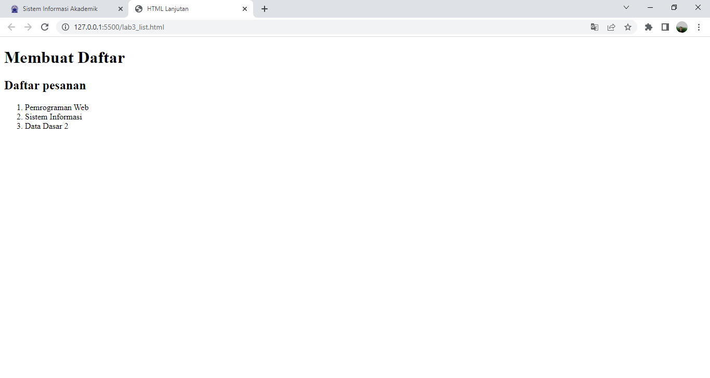
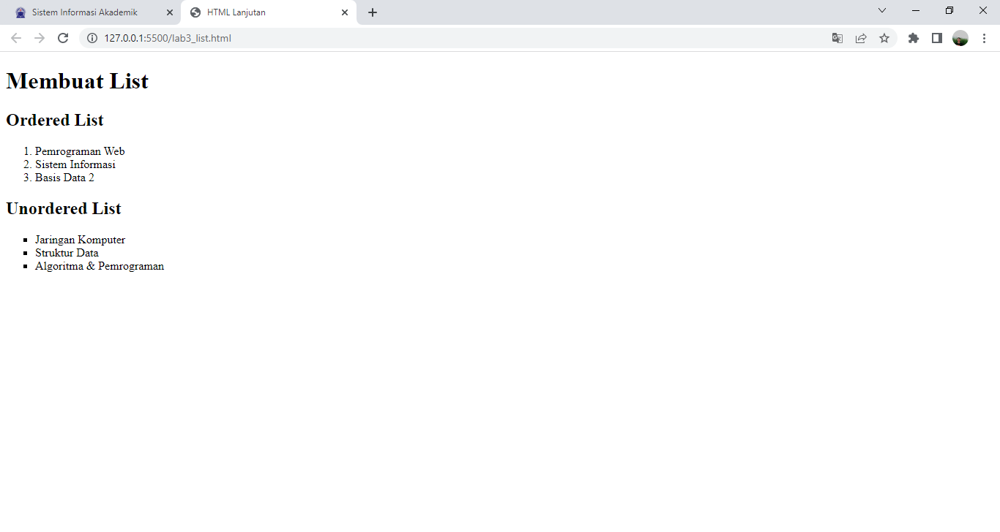

## Mohammad Sofiyan 
## 312010225
## TI.20.A2
## Pemrograman web

## 1.membuat orderlist


orderlist adalah list yang tersusun dan terurut
```html
<section id="order-list">
        <h2>Ordered List</h2>
        <ol>
        <li>Pemrograman Web</li>
        <li>Sistem Informasi</li>
        <li>Basis Data 2</li>
        </ol>
        </section>
```

## 2. membuat unorderlist 


unorderlist adalah list yang acak atau tidak terurut dan tersusun 
```html
<section id="unorder-list">
            <h2>Unordered List</h2>
            <ul type="square">
            <li>Jaringan Komputer</li>
            <li>Struktur Data</li>
            <li>Algoritma &amp; Pemrograman</li>
            </ul>
            </section>
```